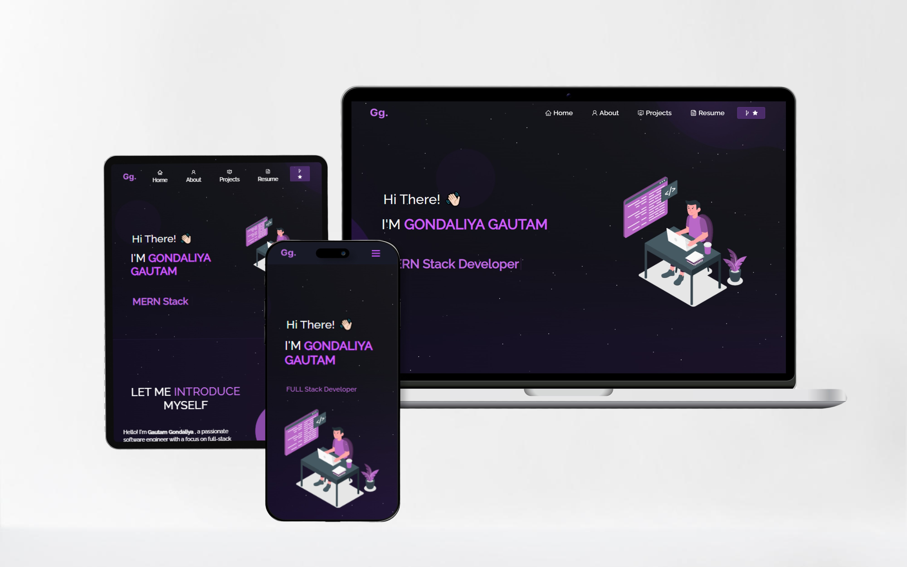

<h2 align="center">
  Portfolio Website - v2.0 
  <a href="https://gautamgondaliya3.netlify.app/" target="_blank">Gautam Gondaliya</a>
</h2>

 

 

 &nbsp;
 &nbsp;
 &nbsp;
 &nbsp;

This project was built using these technologies.

- React.js
- Node.js
- Express.js
- CSS3
- VsCode
- Vercel

Give a ⭐ if you like this website!

"# gautamgondaliya3" 
